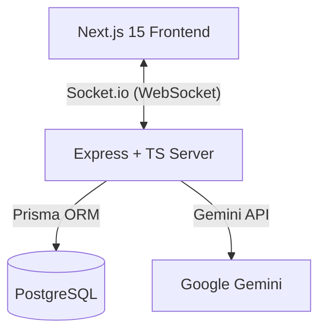

# AI Support Desk

A real-time customer support platform with AI-assisted response drafting. Agents manage incoming tickets across multiple channels, receive AI-generated reply suggestions via Google Gemini, and can refine or rewrite drafts before sending — keeping humans in control of every customer interaction.

Built with **Next.js 15**, **Express + TypeScript**, **Socket.io**, **Prisma + PostgreSQL**, and **Google Gemini**.

---

## Architecture



All client-server communication happens over WebSocket (Socket.io) for real-time ticket updates, message delivery, and typing indicators. REST endpoints handle analytics and health checks.

---

## Features

### Real-Time Support Dashboard
- **Live Ticket Feed:** Incoming tickets from multiple channels (WhatsApp, Web Chat) appear instantly via WebSocket broadcast.
- **Typing Indicators:** Real-time typing status across connected agents.
- **Ticket Resolution:** One-click resolve with immediate database + UI sync.
- **Search & Filters:** Client-side search and status filtering (Open / Resolved).

### AI Copilot
- **Response Drafting:** Gemini generates context-aware reply suggestions based on ticket history and customer message.
- **Tone Modifiers:** Switch between Professional, Friendly, Empathetic, and Persuasive tones before generating.
- **Human Control:** Agents review, edit, or completely rewrite every draft before it reaches the customer.

### Analytics
- **Live KPIs:** Resolution rate, average response time, and channel distribution computed from database records.
- **Chart Widgets:** Interactive analytics with skeleton loaders during data fetch.

### Design
- **Light/Dark Mode:** Theme toggle with localStorage persistence and HSL-based color system.
- **Vanilla CSS:** No CSS frameworks — custom design tokens, responsive layout, and transition animations.

---

## Technical Decisions

| Decision | Rationale |
|----------|-----------|
| Socket.io over polling | Bi-directional real-time updates for tickets, messages, and typing status |
| Zod validation on WebSocket payloads | Prevents malformed data from crashing the server — validates every incoming event |
| Prisma composite unique indexes | Prevents duplicate customer records at the database level |
| Vanilla CSS over Tailwind | Demonstrates layout, theming, and responsive design without framework abstractions |

---

## Code Guide

Key files for understanding the architecture:

| File | What it demonstrates |
|------|---------------------|
| [`server.ts`](backend/src/server.ts) | Socket.io event orchestration, Express REST endpoints, computed analytics |
| [`geminiService.ts`](backend/src/services/geminiService.ts) | Prompt engineering with tone parameters, structured JSON parsing |
| [`validation.ts`](backend/src/lib/validation.ts) | Zod schemas for real-time WebSocket payload validation |
| [`seed.ts`](backend/src/seed.ts) | Database seeding with cascade cleanup patterns |
| [`server.test.ts`](backend/src/server.test.ts) | Integration tests — WebSocket lifecycle, REST endpoint assertions (Jest) |
| [`useSocket.ts`](frontend/src/hooks/useSocket.ts) | Custom React hook for socket state, reconnect logic, typing indicator timers |
| [`globals.css`](frontend/src/app/globals.css) | Design system — CSS custom properties, theme tokens, responsive layout |

---

## Setup

### Prerequisites
- Node.js v18+
- PostgreSQL database
- Google Gemini API Key

### Backend
```bash
cd backend
cp .env.example .env
# Add your GEMINI_API_KEY to .env
npm install
npx prisma db push
npx ts-node src/seed.ts
npm run dev
```
Server runs on `http://localhost:5002` — health check at `/api/health`.

### Frontend
```bash
cd frontend
cp .env.example .env.local
npm install
npm run dev
```
Dashboard at `http://localhost:3001` — login with any credentials for demo mode.

### Tests
```bash
cd backend
npm run test
```

---

## API Reference

### REST
| Method | Endpoint | Description |
|--------|----------|-------------|
| GET | `/api/health` | Health check |
| GET | `/api/analytics` | Live KPIs (resolution rate, response time, channel distribution) |

### Socket.io Events
| Event | Direction | Description |
|-------|-----------|-------------|
| `message:send` | Client → Server | Agent sends a message |
| `message:received` | Server → Client | New message broadcast |
| `typing:status` | Bidirectional | Real-time typing indicators |
| `ticket:resolve` | Client → Server | Resolve a ticket |

---

## License

MIT
